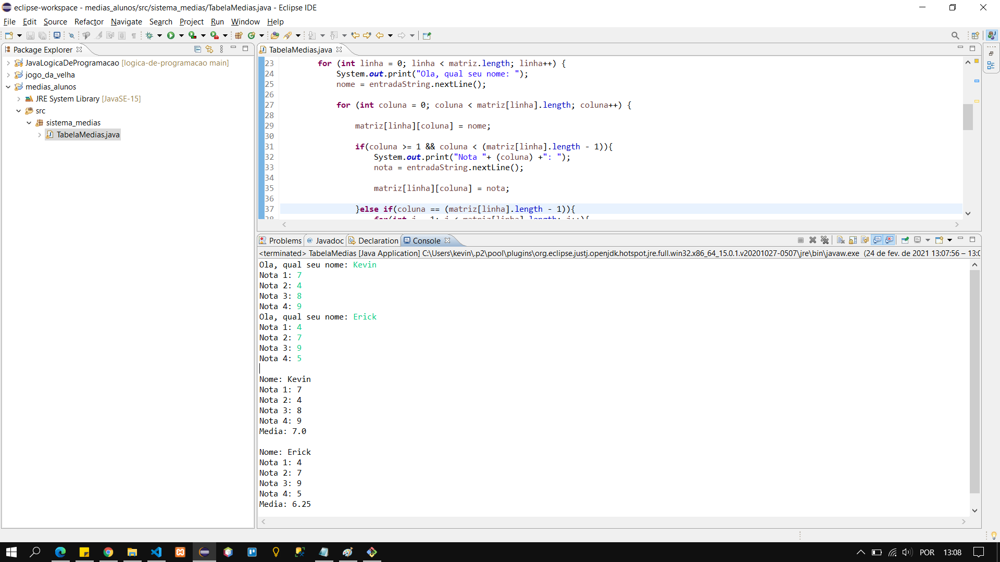

# CALCULADORA DE MEDIA DE ALUNOS

## FUNCIONALIDADE
 - [x] Solicitacao de nome de usuario e suas respectivas notas
 - [x] Armazenamento de todos os dados cadatrados dentro de um unica matriz
 - [x] Apresentacao das notas e media final do aluno
 - [x] Possibilidade de informar a quantidade de alunos e aquantidade de materias do curso
 - [x] Alta capacidade de resposividade ao adicionar varias materias e suas consecutivas notas

## PROXIMAS FUNCIONALIDADES
 - [X] Possibilitar que o usuario insira o RA e outros dados de cada aluno
 - [x] Criar uma interface grafica para integrar o sistema